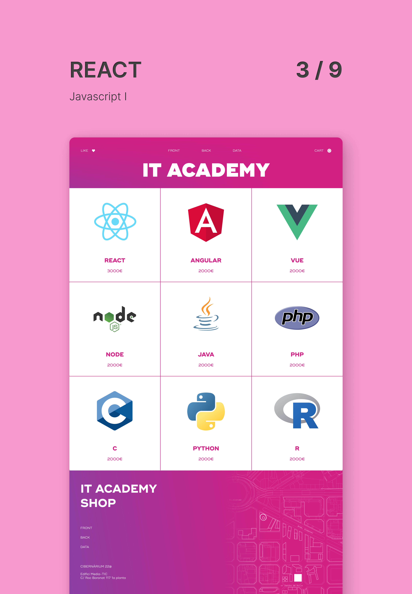

# Javascript I



[Live Site](https://react-sprint-3.netlify.app/)

Implementation of a shopping cart and redesign of the whole look and feel of the site. [GSAP](https://greensock.com/) helped me handle the animations. Used [Parcel](https://parceljs.org/) for bundling. Styling entirely in CSS (using SASS as preprocessor), no bootstrap.

Minimal use of [Firebase](https://firebase.google.com/) to store the hits of a like button.

## Structure

There's a commit for each exercice. The last commit is a reimagination of the site which includes:

- An animated intro screen that reveals the site when scrolling.
- Fading in and out headings showing the current section.
- A whole-width product grid with hover add-to-cart buttons.
- A like button connected to Firebase to track hits.
- Cart contents saved to local storage, to make cart persist after page change and in subsequent site visits.

## Available Scripts

```
npm run start
```

It runs the site on development mode and sets a local server at http://localhost:1234 to visit the site.

```
npm run build
```

It generates all assets for deployment in the `dist` folder.
The files are optimized to reduce space and hashes are employed in filenames to improve chaching.
